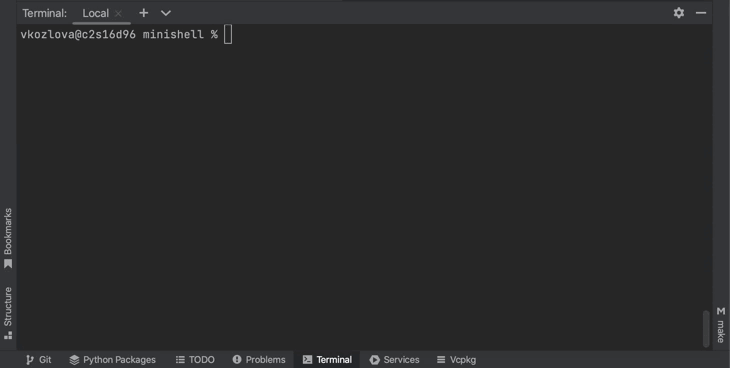

# 42 minishell
Our own version of shell, which works like bash

The shell:
* Displays a prompt when waiting for a new command.
* Has a working history.
* Handles `’` (single quote) which prevents the shell from interpreting the metacharacters in the quoted sequence.
* Handles `"` (double quote) which prevents the shell from interpreting the metacharacters in the quoted sequence except for `$` (dollar sign).
* Implements redirections:
    - `<` redirects input.
    - `>` redirects output.
    - `<<` with a delimiter, reads the input until a line containing the delimiter is seen. However, it doesn’t update the history.
    - `>>` redirects output in append mode.
* Implements pipes (`|` character). The output of each command in the pipeline is connected to the input of the next command via a pipe.
* Handles environment variables (`$` followed by a sequence of characters) which expands to their values.
* Handles `$?` which expands to the exit status of the most recently executed foreground pipeline.
* Handles `ctrl-C`, `ctrl-D` and `ctrl-\` which behave like in bash.
* In interactive mode:
    - `ctrl-C` displays a new prompt on a new line.
    - `ctrl-D` exits the shell.
    - `ctrl-\` does nothing.
* Implements the following builtins:
    - `echo` with option `-n`
    - `cd` with only a relative or absolute path
    - `pwd` with no options
    - `export` with no options
    - `unset` with no options
    - `env` with no options or arguments
    - `exit` with no options
 
* For more check the [subject](subject.pdf)

## Launching the program

To launch the program use command `make`. Then execute `./minishell`. Now you can execute the commands like in bash. It is also possible to run minishell inside minishell, which will increase shell level, so you will need to exit as many times as you 'entered'

### Compatibility
The project is done on `MacOS`, so some features may not work properly on `Linux`
